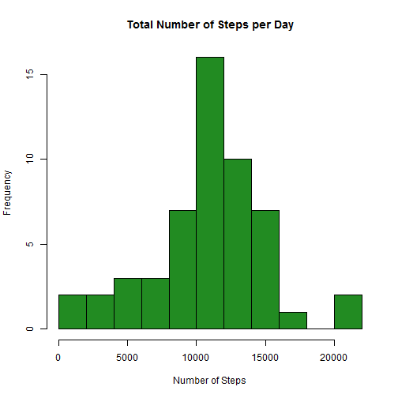
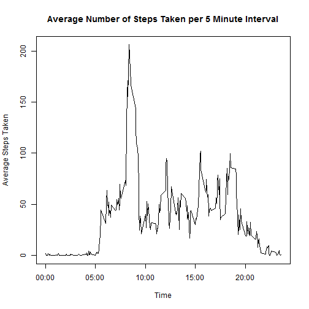
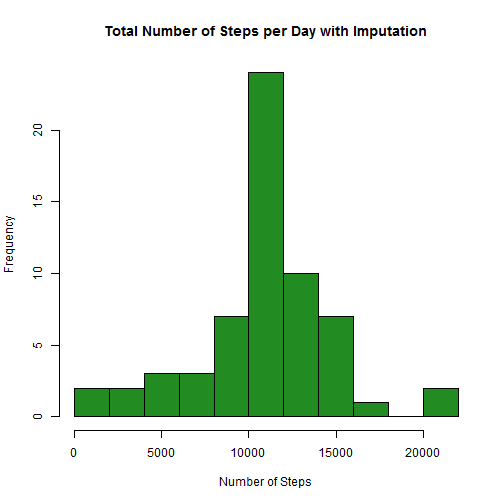

Reproducible Research, Assgnment 1
==================================


Through the use of devices such as Fitbit, Nike Fuelband, and Jawbone Up, large
amounts of data can be collected about personal movement.

The first steps in analyzing the collected data are to load any necessary
packages, read the data, and transform or process the data to make
it usable.  In this example, we will transform the "Date" field from a factor 
into POSIXct.  


```r
library(plyr)
```

```
## Warning: package 'plyr' was built under R version 3.1.2
```

```r
library(dplyr)
```

```
## Warning: package 'dplyr' was built under R version 3.1.2
```

```
## 
## Attaching package: 'dplyr'
## 
## The following objects are masked from 'package:plyr':
## 
##     arrange, count, desc, failwith, id, mutate, rename, summarise,
##     summarize
## 
## The following object is masked from 'package:stats':
## 
##     filter
## 
## The following objects are masked from 'package:base':
## 
##     intersect, setdiff, setequal, union
```

```r
library(tidyr)
```

```
## Warning: package 'tidyr' was built under R version 3.1.2
```

```r
library(lubridate)
```

```
## Warning: package 'lubridate' was built under R version 3.1.2
```

```
## 
## Attaching package: 'lubridate'
## 
## The following object is masked from 'package:plyr':
## 
##     here
```

```r
library(lattice)
data <- read.csv("~/Coursera/repdata_data_activity/activity.csv")
data$date = ymd(data$date)  
```
###What is the mean total number of steps taken per day?

In this section, we will ignore any missing values and calculate the mean
and median number of steps taken each day.  We will then make a histogram
showing the total number of steps taken each day.


```r
na_removed <- data[complete.cases(data), ]  
daily_data <- ddply(na_removed, .(date), summarize, 
                daily_steps = as.numeric(sum(steps)))
mean_steps <- mean(daily_data$daily_steps)
median_steps <- median(daily_data$daily_steps)
mean_steps
```

```
## [1] 10766.19
```

```r
median_steps
```

```
## [1] 10765
```

```r
hist(daily_data$daily_steps, col = "forestgreen", breaks = "FD",
                main = "Total Number of Steps per Day",
                xlab = "Number of Steps")
```

 

The mean steps taken per day is **10766.19** and the median steps taken
per day is **10765**.

###What is the average daily activity pattern?

For this section, the goal is to calculate the average number of steps taken
per time interval, averaged across all days.  This is shown in the following
line graph.


```r
average_interval <- ddply(na_removed, .(interval), summarize,
                avg_steps = mean(steps))
plot(average_interval$interval, average_interval$avg_steps, type = "l",
                main = "Average Number of Steps Taken per 5 Minute Interval",
                xlab = "Time",
                ylab = "Average Steps Taken",
                xaxt = "n")
axis(side = 1, at = c(0, 500, 1000, 1500, 2000),
                labels = c("00:00", "05:00", "10:00", "15:00", "20:00"))
```

 

From this result, the 5 minute interval averaging the highest number of steps
can be found using the max() function

```r
max_interval <- filter(average_interval, avg_steps == max(avg_steps))
max_interval
```

```
##   interval avg_steps
## 1      835  206.1698
```
Thus, the maximum average steps are **206.2** and occurs at **08:35**.

###Imputing missing values

The purpose of this section is to impute the missing values and determine how
the mean and median are affected compared to ignoring missing values.

The first step is to find the total number of missing values.  Using:

```r
total_na <- sum(is.na(data))
total_na
```

```
## [1] 2304
```
the total number of missing values was found to be **2304**.

In order to fill in the missing values, I used the mean for that 5-minute
interval.  A new dataset, containing no missing values, was then created.


```r
imputed_data <- data %>%
                group_by(interval) %>%
                mutate(steps = ifelse(is.na(steps),
                          mean(steps, na.rm = TRUE),
                          steps))
imputed_daily_data <- ddply(imputed_data, .(date), summarize, 
                imputed_daily_steps = as.numeric(sum(steps)))
head(imputed_daily_data)                
```

```
##         date imputed_daily_steps
## 1 2012-10-01            10766.19
## 2 2012-10-02              126.00
## 3 2012-10-03            11352.00
## 4 2012-10-04            12116.00
## 5 2012-10-05            13294.00
## 6 2012-10-06            15420.00
```

For comparison, the median and mean were calculated with this new dataset:


```r
imputed_mean_steps <- mean(imputed_daily_data$imputed_daily_steps)
imputed_median_steps <- median(imputed_daily_data$imputed_daily_steps)
imputed_mean_steps
```

```
## [1] 10766.19
```

```r
imputed_median_steps
```

```
## [1] 10766.19
```
Recall, the mean and median were previously found to be **10766.19** and 
**10765**, respectively.  With the imputed data, the new mean is **10766.19**
and the new median is **10766.19**.  Therefore, mean and median were not
significantly affected by imputation.  As the following histogram shows,
however, frequency was changed.


```r
hist(imputed_daily_data$imputed_daily_steps, col = "forestgreen", breaks = "FD",
                main = "Total Number of Steps per Day with Imputation",
                xlab = "Number of Steps")
```

 

###Are there differences in activity patterns between weekdays and weekends?

for this last section, a new dataset was created.  This dataset added a column
to the imputed data that gave "weekday" or "weekend" for each date.

```r
weekday <- c("Monday", "Tuesday", "Wednesday", "Thursday", "Friday")
weekday_data <- mutate(imputed_data, weekday_weekend = ifelse(weekdays(date)
                %in% weekday, "weekday",
                "weekend"))
weekday_weekend_data <- aggregate(steps ~ interval + weekday_weekend, 
                weekday_data, mean)
head(weekday_weekend_data)
```

```
##   interval weekday_weekend      steps
## 1        0         weekday 2.25115304
## 2        5         weekday 0.44528302
## 3       10         weekday 0.17316562
## 4       15         weekday 0.19790356
## 5       20         weekday 0.09895178
## 6       25         weekday 1.59035639
```
From this new dataset, a plot was created that compared weekend activity
level to weekday activity level.  This was done by plotting the 5-minute
interval vs average number of steps taken, averaged across all weekday days or
weekend days.

```r
xyplot(steps ~ interval | weekday_weekend, weekday_weekend_data, type = "l",
                layout = c(1, 2), xlab = "Interval", ylab = "Number of Steps")
```

 

